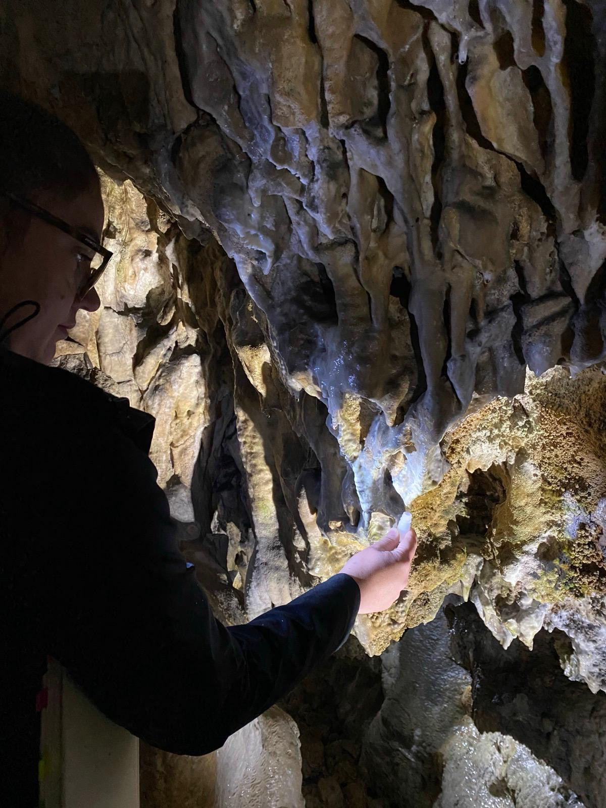
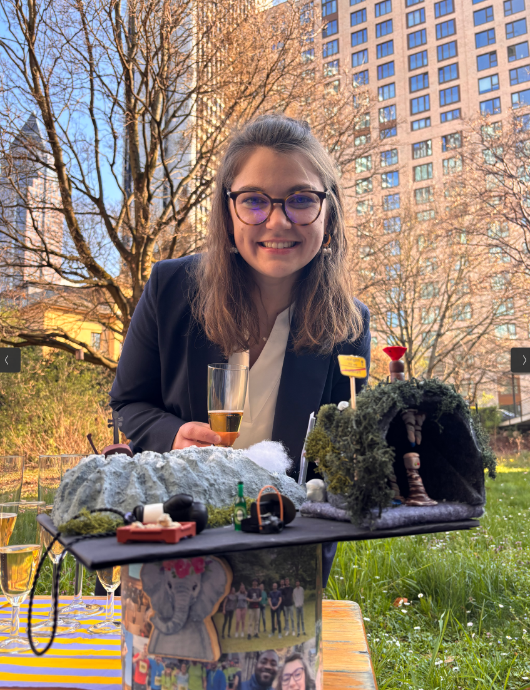
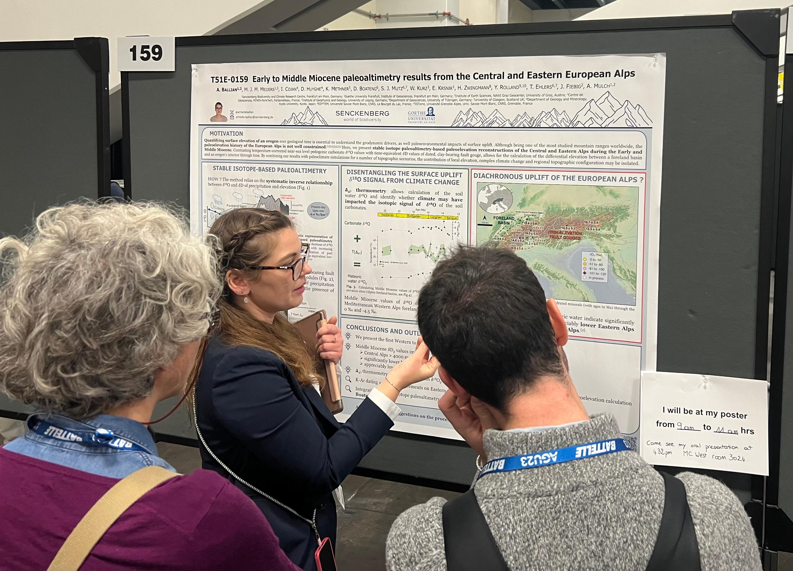
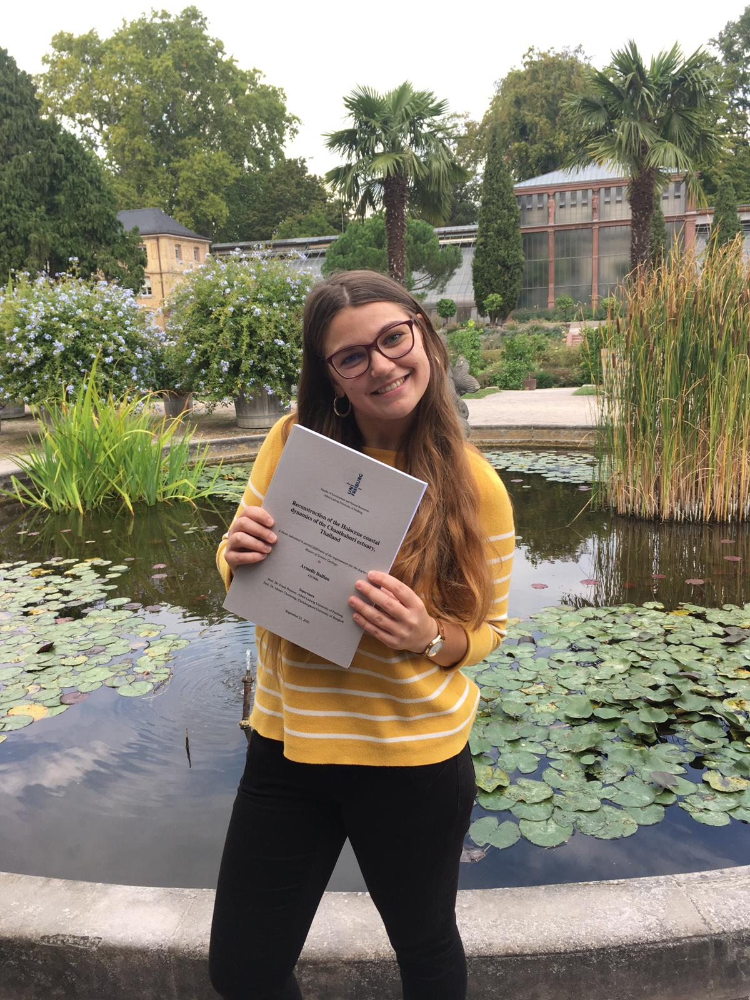

:::{#template-area}
## Background

I'm a passionate geologist and paleoclimate scientist based in Tübingen, Germany. With a deep love for understanding Earth's processes, I dedicate my work to uncovering the past climates and environments of our planet. My main interests cover isotope geochemistry, paleoclimatology, exogenous processes, and paleoenvironmental studies.

I graduated with a Master's degree in Geology from the [University of Freiburg im Breisgau](https://www.sedimentologie.uni-freiburg.de/){target="_blank"}. My MSc thesis aimed at reconstructing the Holocene coastal dynamics of the Chanthaburi estuary in the Gulf of Thailand integrating mapping with detailed stratigraphy and the application of Optical Stimulated Luminescence (OSL).  
I pursued my academic journey in 2021 with a PhD at [the Senckenberg Biodiversity and Climate Research Centre](https://www.senckenberg.de/en/research/institutes-overview/sbikf-institut/sbikf-ag-paleoclimate-and-paleoenvironmental-dynamics/){target="_blank"} in Frankfurt am Main expending my knowledge in paleoclimate and geochemistry. 

My PhD project was part of the second phase of a DFG-funded SPP  ‘Mountain Building Processes in Four Dimensions (MB-4D)’.The project, entitled ‘Reconstructing Eastward Propagation of Surface Uplift in the Alps: Integrating Stable Isotope Paleoaltimetry and Paleoclimate Modelling (REAL)’ aimed at constraining the surface uplift history of the European Alps in a paleoclimatic context. 
My project focused on the Western and Eastern Alps, along with extending the record for the Central Alps to pre-Miocene times. The research focused on stable isotope-based paleoelevation and paleoclimate reconstructions (ẟ18O, ẟD, D47-D48). The obtained ẟ-ẟ paleoaltimetry and clumped isotope-derived paleotemperature records were coupled with an isotope tracking atmospheric General Circulation Model (GCM) performed by colleagues from the ‘Earth System Dynamics Group’ at the University of Tübingen.  

When I am not working in the lab, I am playing cello, boxing, crafting, or hiking (in the Alps).

:::

:::{#template-area}
## Current research

Since April 2025, I joined the [Climatology and the Biosphere group](https://uni-tuebingen.de/en/fakultaeten/mathematisch-naturwissenschaftliche-fakultaet/fachbereiche/geowissenschaften/arbeitsgruppen/geo-und-umweltnaturwissenschaften/geo-und-umweltnaturwissenschaften/climatology-and-the-biosphere/workgroup/){target="_blank"} at the university of Tübingen as a Postdoctoral Researcher. 

In my current role, I am particularly interested in the hydrological cycle on the Swabian Alb karstic region and understanding the links between (paleo)climatic, atmospheric, hydrospheric, and biospheric processes.

My research integrates data from an extensive cave climate monitoring network across the Swabian Alb with daily rainwater samples and meteorological observations from the weather station on the roof of our institute in Tübingen. Together with a Bachelor's and a Master's project that I am currently supervising, this work will provide a comprehensive understanding of the spatial and temporal variability of water stable isotopes from different sources across the Swabian Alb. It will also shed light on dripwater residence times and the hydrological pathways that control water movement through the Swabian Alb cave systems. Also, by comparing observation-based stable isotope records across the Swabian Alb with isotope-enabled climate models, I aim to analyze interannual variations in precipitation, as well as teleconnections and seasonality patterns.

{fig-align="center" width=50%}
*Sampling cave drip water in the Schertelshoehle, Swabian Alb (August 2025) ©V. Novello*

:::

:::{#template-area}
## Education

2021-2025 | PhD student | Senckenberg Climate and Biodiversity Research Centre (SBiK-Frankfurt am Main, Germany) 

2017-2020 | Master of Science in Geology, Focus Geohazards | University of Freiburg im Breisgau (Germany)

2014-2017 | Bachelor of Science in Geology | Jean Monnet University (Saint-Etienne, France) and ERASMUS at University of Freiburg im Breisgau (Germany)
:::
___

{fig-align="center" width=50%}
*I successfully defended my PhD on March 2025 at the Biodiversity and Climate Research Centre in Frankfurt am Main.*

{fig-align="center" width=50%}
*Poster presentation at AGU23 for which I received an OSPA award (2023).*

{fig-align="center" width=50%}
*Go back to when the Master thesis was ready to submit and the academic journey ready to begin (2020).*

---

