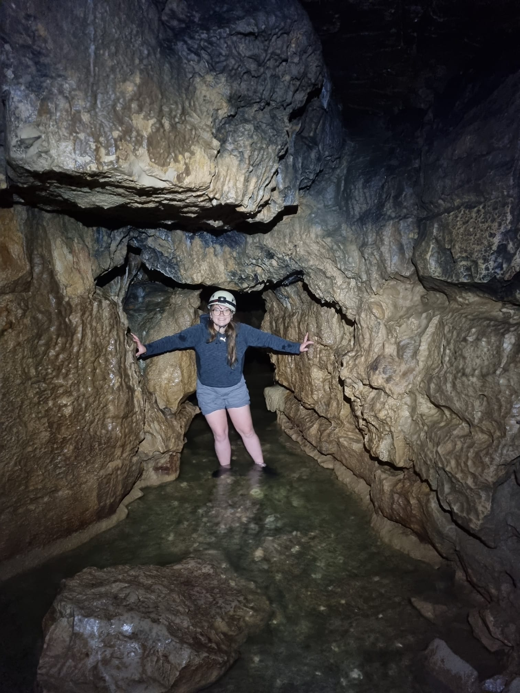
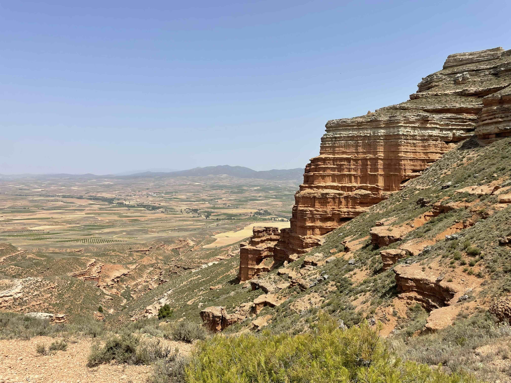
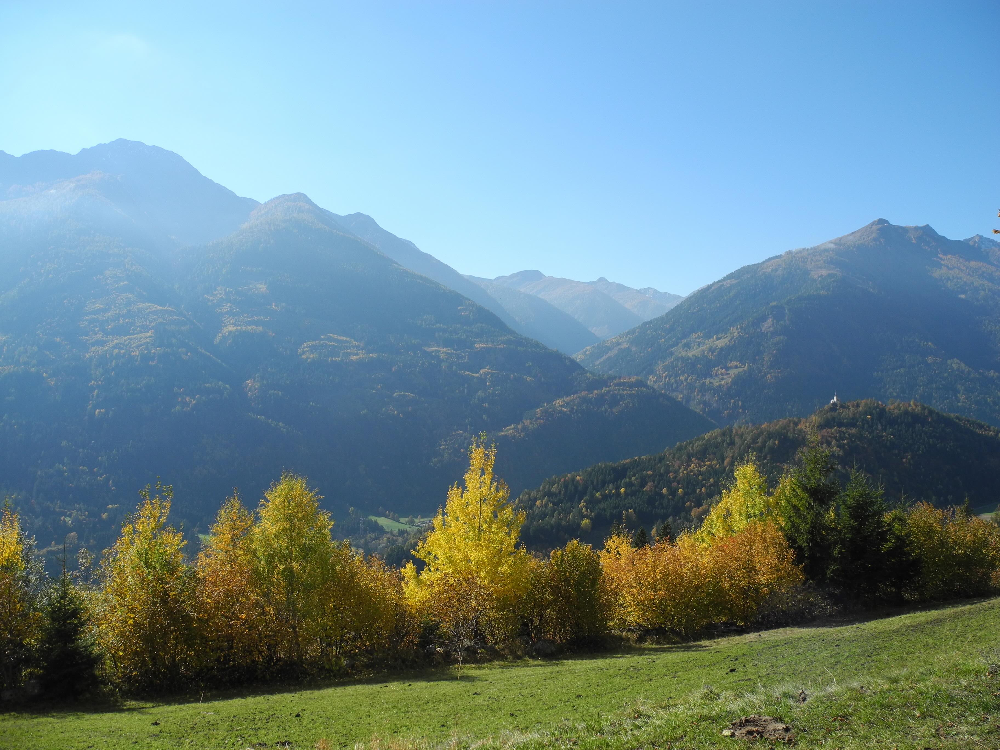
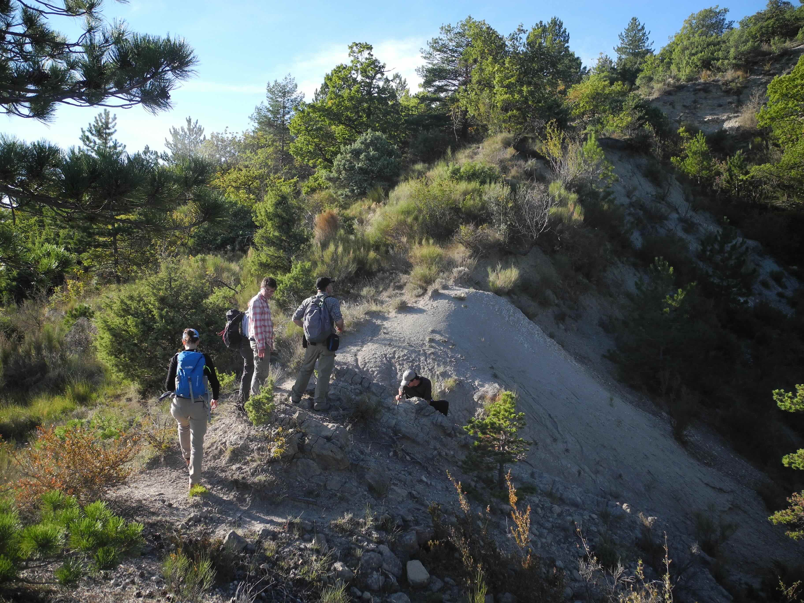
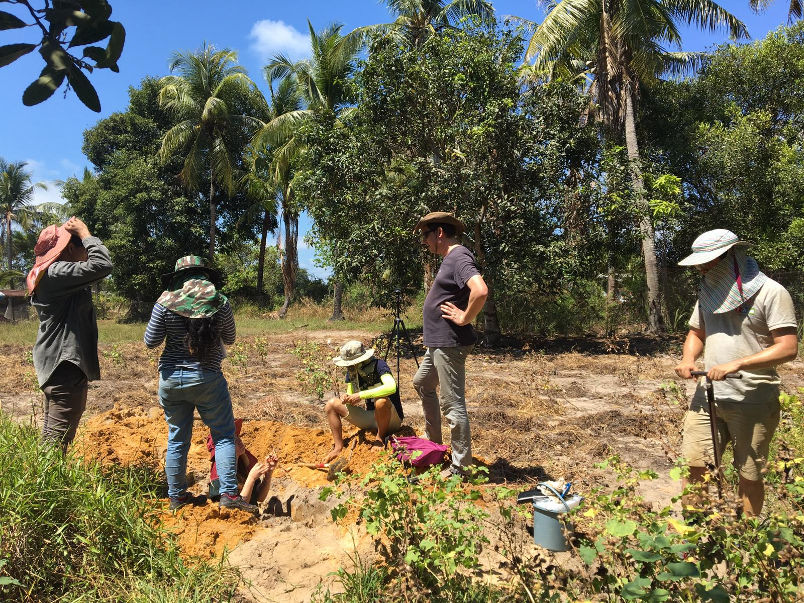
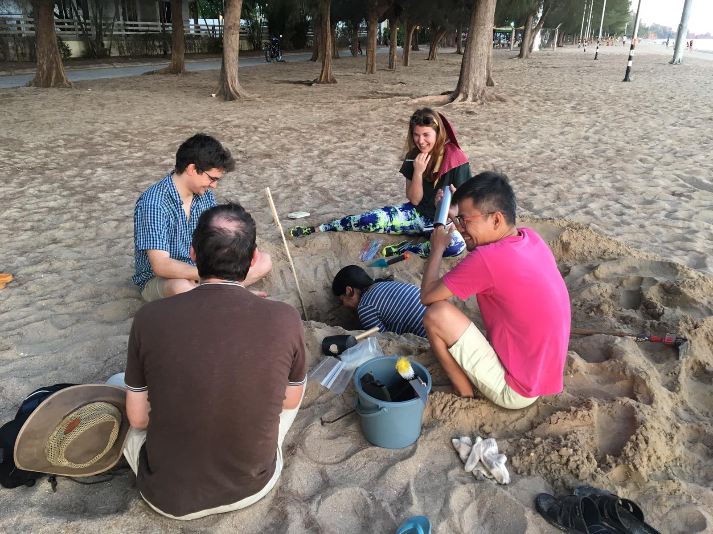

[comment]:  (Tasks for this page
Update the YAML header. you can check out different layouts of the pre-formatted part at <https://quarto.org/docs/websites/website-about.html#templates>
Update the legal information
Write a short introduction set of you
delete this section)
:::{#template-area}
I am currently postdoc within the *Climatology and the Biosphere* research group at the University of Tübingen (Germany). 

## Fields of specialization
Continental paleoclimate and paleoenvironmental dynamics, surface processes, geomorphology, stable isotope paleoaltimetry, terrestrial carbonates and paleosols, fault gouges, karst systems and cave climate monitoring, stable isotope geochemistry (δ^13^C, δ^17^O, δ^18^O, δ^2^H), and carbonate clumped (∆47) isotope thermometry.

## Contact

I'd be happy to connect regarding research, collaborations, or teaching opportunities.

 ✉️ **Email:** armelle.ballian@uni-tuebingen.de  
☎️ **Tel:** +49 7071 29 72492  
📍 **Address:** Eberhard Karls University Tübingen, Geo- and Environmental Research Center,  
                Schnarrenbergstraße 94-96, D-72076 Tuebingen, Germany

:::
## News

May 2026: I presented my current work at the EGU26 conference in Vienna.  
March 2026: I successfully defended my PhD thesis!  

Below are some pictures from the fieldwork carried out during my Master’s, PhD and postdoc.
::: {.image-container}
{width=50%}
*Falkensteiner Höhle, Swabian Alb (2025) ©Y. Wolfhard*

{width=50%}
*Armantes section, Central Spain (2022)*

{width=50%}
*Mölltal Valley, Austria (2021)*

{width=50%}
*Digne Valensole basin, SE France | Sampling pedogenic carbonate nodules (2021)*

{width=50%}
*Chanthaburi, Thailand | Excavating beach ridges (2019) ©J. Miocic*

{width=50%}
*Chanthaburi, Thailand | Excavating beach ridges (2019) ©S. Chawchai*
:::

---

