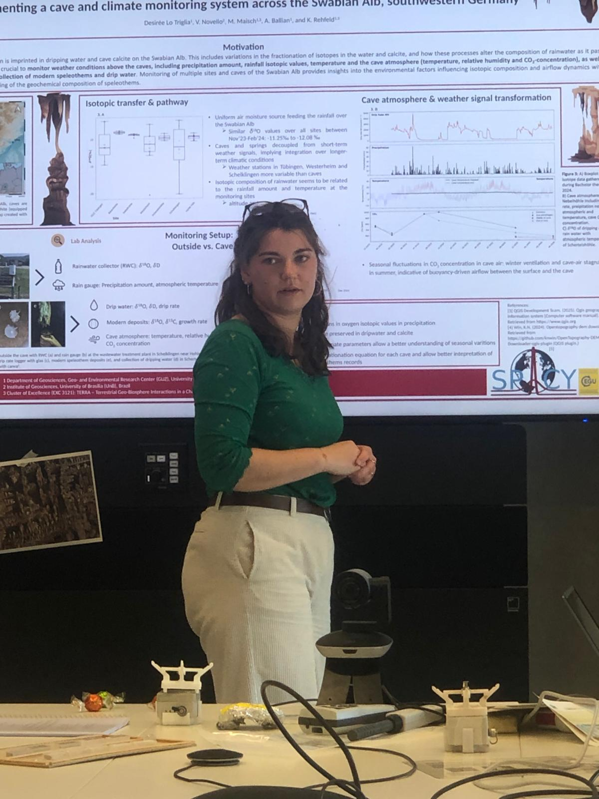

---
pagetitle: "Public outreach"
---

## Public outreach 
# Exkursion der Museumsgesellschaft und des Eiszeitstudios Hohle Fels nach Tübingen  
"Am 24.4. 2026 machten sich 13 Hohle Fels Guides, zwei Gemeinderäte und 2 weitere Mitglieder der Museumsgesellschaft Schelklingen auf den Weg nach Tübingen.  
Ziel waren die Arbeitsgruppe Klimatologie und Biosphäre am Geo- und Umweltforschungszentrum (GUZ), und das Schloß Hohentübingen, wo die Ausstellung Dirty Science und das Museum der Universität Tübingen auf dem Programm standen. Zum Abschluss gab es eine Führung durch die Abteilung für Ältere Urgeschichte und Quartärökologie am Institut für Ur- und Frühgeschichte und Archäologie des Mittelalters. Die Exkursion begann mit einer Einführung durch Dr. Markus Maisch und Armelle Ballian. Sie versuchen im Rahmen des Projekts „Klima- und Höhlenüberwachung auf der Schwäbischen Alb“ vergangenes Klima anhand von Tropfsteinen und Isotopen im Karstwasser zu erschließen. Der Hohle Fels ist dabei eine von 5 Referenzhöhlen auf der Schwäbischen Alb.[...]" 

# Field Trip by the Museum Society and the Hohle Fels Ice Age Studio to Tübingen  
(translation) "On April 24, 2026, 13 Hohle Fels guides, two city council members, and two other members of the Schelklingen Museum Society set out for Tübingen.  
Their destinations were the Climatology and Biosphere Working Group at the Geo- and Environmental Research Center (GUZ) and Hohentübingen Castle, where the “Dirty Science” exhibition and the University of Tübingen Museum were on the itinerary. The trip concluded with a guided tour of the Department of Early Prehistory and Quaternary Ecology at the Institute for Prehistory, Early History, and Medieval Archaeology. The field trip began with an introduction by Dr. Markus Maisch and Armelle Ballian. As part of the project “Climate and Cave Monitoring in the Swabian Alb,” they are attempting to reconstruct past climate patterns using stalactites and isotopes in karst water. The Hohle Fels is one of five reference caves in the Swabian Alb.[...]"  

---
## Miscellaneous 

2023 | Development of a streamlit application for (clumped isotope) data visualization: [https://clumped.streamlit.app/]](https://clumped.streamlit.app/){target="_blank"}

